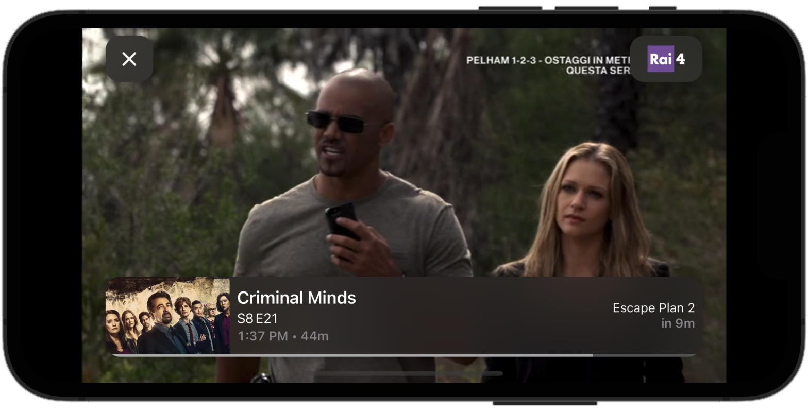

# Tivu

<table>
    <tr>
        <td>
            
        </td>
        <td>
            
        </td>
    </tr>
    <tr>
        <td colspan=2>
            
        </td>
    </tr>
</table>

## Build

1. Ensure that the CocoaPods gem installed, preferably using a Ruby version manager (rbenv, rvm, asdf-ruby):

```console
$ gem install cocoapods
```

2. Download the dependencies required by the project:

```console
$ pod install
```

3. Open the project workspace with Xcode:

```console
$ open -a Xcode Tivu.xcworkspace
```

## Clarifications

The reason for manually dealing with `NSBatchUpdateRequest`, `NSBatchDeleteRequest`, `mergeChanges(fromRemoteContextSave:into:)` is the following: deleting all entities from a Core Data persistence store would require the use of `NSBatchDeleteRequest`. Such operations don't trigger any Core Data save notifications since they operate at the persistence store level and not within a `NSManagedObjectContext`. When inserting new data, the view context would have duplicate data. A solution to that would be manually triggering a save notification for *all* deleted object IDs which could be quite expensive.  
Instead, the used approach, inserts new entities ensuring that they replace the existing ones (if already there), maintaining the original object ID thanks to Core Data constraints and  `NSMergePolicy.mergeByPropertyObjectTrump`. This allows to manually trigger a much smaller save notification for only the delta of actually deleted objects. (All inserted objects do generate the same size of save notifications, but this is handled by Core Data and could potentially be batched.)

## Known Issues

- Rotating the device during playback may occasionally dismiss the video player. This appears to be an unwanted behavior of SwiftUI `fullScreenCover(isPresented:onDismiss:content:)`.

To also consider during development:

- Device rotation may not work when the app is started from Xcode. Restarting the app from the device fixes this.
- The video player is not optimized for Simulator and playback is therefore choppy and may occasionally crash. Using the app on an actual device doesn't result in these issue.
